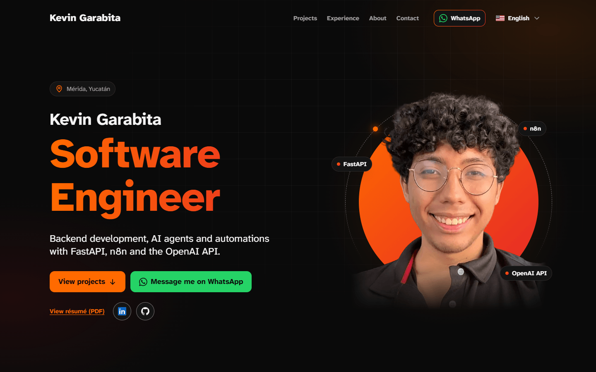
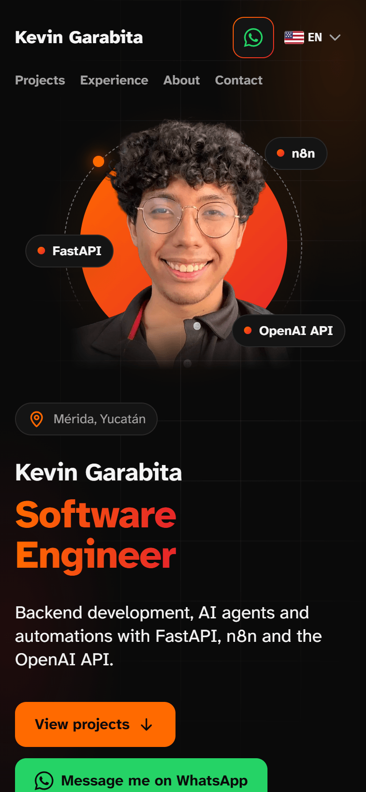

# Kevin Garabita — Portfolio

[](https://github.com/KevinGarabita/Portfolio/actions/workflows/ci.yml)

Source code of the personal site of **Kevin Garabita**, a Backend, AI & Automation Engineer based in Mérida, Yucatán, Mexico. It presents his case studies, experience, education and contact details in four languages: English (the default), Spanish, Portuguese and French.

**Live site: [www.garasoftware.com.mx](https://www.garasoftware.com.mx)**

<p align="center">
  
  
</p>

## Highlights

- **Four languages without an i18n library**, with types that fail the build when a text is missing in any of them.
- **Every page is static HTML**, generated at build time for each language and project.
- **SEO built from the content**: complete metadata on every page, `hreflang`, a sitemap dated by the content, Open Graph images rendered at build time and JSON-LD structured data.
- **Accessibility as a gate**: the full `jsx-a11y` recommended rule set with zero warnings allowed, keyboard and screen-reader support in the menus, filters and gallery, and measured colour contrast.
- **Three runtime dependencies**: `next`, `react` and `react-dom`. No UI kit, animation library or i18n package.
- **Continuous integration** on every pull request: lint, typecheck, formatting and a production build.

## Tech stack

| Area          | Choice                                                                                     |
| ------------- | ------------------------------------------------------------------------------------------ |
| Framework     | [Next.js](https://nextjs.org) 16.4 (App Router, Turbopack)                                 |
| UI            | React 19.3                                                                                 |
| Language      | TypeScript 6.0 (`strict`)                                                                  |
| Styling       | Tailwind CSS 4.3 through PostCSS, with the design tokens in `src/app/globals.css`          |
| Quality       | ESLint 10 (Next.js Core Web Vitals, TypeScript and `jsx-a11y` rules), Prettier 3.9         |
| Runtime       | Node.js 24 LTS                                                                             |
| Hosting       | Vercel                                                                                     |
| Fonts, images | `next/font` (Atkinson Hyperlegible Next, self-hosted), `next/image`, `next/og` for sharing |

## Key decisions

Each decision is written down with its reason in [`docs/decisions.md`](docs/decisions.md) and [`docs/design.md`](docs/design.md) (both in Spanish). The short version:

### Internationalization without a library

- **Every page lives under `src/app/[lang]`**, so the root layout renders the right `<html lang>` and each language is generated as its own static HTML.
- **The locale comes from `next/root-params`** (`lang()`), read in the layout, pages and sections. Small presentational components and Client Components receive the locale or the translated text through props.
- **`src/proxy.ts` sends URLs without a language prefix** to the language the visitor picked in the language menu (stored in the `preferred-locale` cookie) or, without that cookie, to English. The browser's `Accept-Language` is not used: everyone sees English first and can choose another language.
- **Interface text lives in typed dictionaries** (`src/i18n/dictionaries/`). The `Dictionary` type is the shape of the Spanish dictionary, so a key missing in another language is a type error, and a new locale does not compile until its dictionary is registered.
- **Content uses `LocalizedText`** (`Record<Locale, string>`), so every project, job and skill has to be written in all four languages.

### SEO

- **One helper builds the metadata of every page** (`buildPageMetadata` in `src/lib/metadata.ts`): title, description, canonical URL, `hreflang` alternates, Open Graph and the X card. Next.js merges metadata shallowly (a page that sets `openGraph` replaces the layout's whole object), so each page gets the complete set from one place.
- **The sitemap is dated by the content**: each project uses its `lastUpdated` date and the home page the most recent content date, never the build date, so a redeploy does not claim that every page changed.
- **Open Graph images are rendered at build time** with `next/og`, one per language and project. They are text only (about 50 KB) because WhatsApp tends to drop link previews heavier than about 300 KB; a version with the photo weighed 470–600 KB.
- **JSON-LD structured data** is built in `src/lib/structured-data.ts` from the same content files as the pages; the home page describes Kevin as a schema.org `Person` on a `ProfilePage`.
- **Descriptions only use facts from the CV**, kept with the rest of the content in `src/content/`.

### Performance

- **Static generation everywhere**: `generateStaticParams` lists every language and project, and `dynamicParams = false` rejects anything else. Cache Components stays off: the site is fully static, and with it enabled a missing project answered 200 on its first request.
- **Real 404s**: `app/global-not-found.tsx` answers any unknown URL with a server-rendered 404 page in all four languages.
- **`next/image`** for every photo and screenshot, with `sizes` that match the layout.
- **Self-hosted font** through `next/font`: the font files are downloaded at build time and served from the same domain.
- **Motion only animates `transform` and `opacity`**, so nothing moves the layout, and it stops with the system's `prefers-reduced-motion` setting. Scroll reveals are progressive enhancement: the HTML arrives fully visible, and content is hidden only after the script knows what is already on screen. The hero photo, the largest element on the first screen, never starts invisible.

### Accessibility

- One `h1` per page, ordered headings, landmarks (`header`, `nav`, `main`, `footer`) and a skip-to-content link.
- A visible focus ring on every interactive element; anchors and focused elements are never hidden behind the sticky header.
- The language menu and the project filters follow the disclosure pattern (`aria-expanded`, `aria-controls`, Escape closes and returns focus). The screenshot gallery opens in a native `<dialog>` with keyboard navigation.
- Colour contrast is measured and documented in `docs/design.md`; colours below 4.5:1 are never used for small text.
- Touch targets of at least 24 px, and links that open a new tab say so to screen readers.

## Lighthouse

Measured on a **local production build** (`next build` + `next start`) with Lighthouse 13.5 and mobile emulation on 2026-10-10. Scores on the live site may differ.

| Page                                | Performance | Accessibility | Best Practices | SEO |
| ----------------------------------- | ----------: | ------------: | -------------: | --: |
| `/es`                               |          93 |           100 |            100 | 100 |
| `/en`                               |          94 |           100 |            100 | 100 |
| `/es/projects/field-report-manager` |          94 |           100 |            100 | 100 |

## Getting started

Requirements: Node.js 24 (the version in `engines`) and npm.

```bash
npm ci
cp .env.example .env.local   # optional for local work, see below
npm run dev                  # http://localhost:3000
```

### Scripts

| Command                | What it does                                                         |
| ---------------------- | -------------------------------------------------------------------- |
| `npm run dev`          | Development server on http://localhost:3000.                         |
| `npm run build`        | Production build.                                                    |
| `npm run start`        | Serves the production build.                                         |
| `npm run lint`         | ESLint; fails on any warning.                                        |
| `npm run lint:fix`     | Fixes what ESLint can fix automatically.                             |
| `npm run typecheck`    | Generates the route types and runs the TypeScript compiler.          |
| `npm run format`       | Formats every file with Prettier.                                    |
| `npm run format:check` | Checks formatting without changing files.                            |
| `npm run check`        | Lint, typecheck, format check and build. Must pass before any merge. |

### Environment variables

Only one variable is ever set by hand; Vercel provides the others.

| Variable                        | Purpose                                                                                                                                                           | Where to set it                                                                            |
| ------------------------------- | ----------------------------------------------------------------------------------------------------------------------------------------------------------------- | ------------------------------------------------------------------------------------------ |
| `NEXT_PUBLIC_SITE_URL`          | Base URL of the site, without a trailing `/`. Feeds `metadataBase`, the Open Graph image URLs, canonical URLs, `hreflang`, the sitemap, `robots.txt` and JSON-LD. | Vercel, Production environment, with the primary domain; redeploy afterwards (build time). |
| `VERCEL_PROJECT_PRODUCTION_URL` | Production domain without a scheme; fallback when `NEXT_PUBLIC_SITE_URL` is empty.                                                                                | Nowhere: Vercel sets it.                                                                   |
| `VERCEL_ENV`                    | Deployment environment. A production build fails while any `[PLACEHOLDER]` content remains.                                                                       | Nowhere: Vercel sets it.                                                                   |

With none of them set, the site uses `http://localhost:3000`.

## Project structure

```
src/
  app/
    [lang]/              root layout per language (/en, /es, /pt, /fr), pages and Open Graph images
    global-not-found.tsx 404 page in all four languages for any URL that does not exist
    globals.css          Tailwind and the design tokens
    sitemap.ts           /sitemap.xml
    robots.ts            /robots.txt
    icon.svg             KG monogram (also apple-icon.png and favicon.ico)
  proxy.ts               sends URLs without a language to the saved language or English
  assets/fonts/          Atkinson Hyperlegible Next TTF files (OFL) for the Open Graph images
  components/
    layout/              header, footer, language menu, skip link
    sections/            home page sections
    projects/            cards, filters, gallery, flow diagram and case-study parts
    motion/              scroll reveal and the rotating title
    ui/                  building blocks: container, section, button, tag, icons, flags
    seo/                 JSON-LD and the Open Graph image layout
  content/               site data: profile, projects, experience, education, skills, SEO texts
  i18n/                  locales and interface dictionaries
  lib/                   site URL, metadata, structured data, dates, projects and other helpers
  types/                 content types
public/
  cv/                    résumé PDFs
  images/                profile photo and project screenshots
docs/                    technical and design decisions, deployment guide (in Spanish)
.github/workflows/       continuous integration
```

## Adding a project

1. Create a file in `src/content/projects/` and add it to the array in `src/content/projects/index.ts` (that order is the order on the site). The `Project` type in `src/types/content.ts` describes every field, and TypeScript flags anything missing. `kind` feeds the "Type" filter on `/[lang]/projects`, `isFeatured: true` also shows the project on the home page, screenshots go in `public/images/projects/<slug>/` and in `images`, and automation flows go in `flowDiagram`.
2. Write every text in the four languages, `{ es: "...", en: "...", pt: "...", fr: "..." }`, or use `sameInEveryLanguage("...")` when it reads the same in all of them.
3. Set `lastUpdated` to the date of the change (`"YYYY-MM-DD"`); the sitemap uses it.
4. Run `npm run check`.

No component needs to change: the project card, the filters, the case-study page `/[lang]/projects/[slug]`, its Open Graph image and its sitemap entry are all generated from the data.

If you change the profile, experience, education or skills, also update `siteLastUpdated` in `src/content/site-metadata.ts`.

Text that still needs real information is written with `placeholderText()` and shows `[PLACEHOLDER]`. A production build on Vercel fails while any remains, so none can go live by accident.

## Quality gates

- **Locally**, `npm run check` runs ESLint (zero warnings), the TypeScript compiler, Prettier and a production build.
- **On GitHub**, [`.github/workflows/ci.yml`](.github/workflows/ci.yml) runs the same steps (`npm ci`, lint, typecheck, format check, build) on Node.js 24 for every pull request and every push to `dev`. It only reads the repository, and a new push cancels the run it replaces.
- **On Vercel**, every pull request gets a preview deployment.

## Workflow

- `main` is production and `dev` is the base branch.
- Every change gets its own branch from `dev` (`feat/...`, `fix/...`, `docs/...`, `chore/...`), uses [Conventional Commits](https://www.conventionalcommits.org) and reaches `dev` through a pull request with its Vercel preview.

## Documentation

These documents are written in Spanish:

- [`docs/decisions.md`](docs/decisions.md): technical decisions and their reasons (versions, language routing, 404 pages, SEO and metadata, dependency security).
- [`docs/design.md`](docs/design.md): the design system (colours and measured contrast, typography, layout, motion, focus and accessibility).
- [`docs/deployment.md`](docs/deployment.md): step-by-step guide to deploy on Vercel, connect the domain and check the result.
